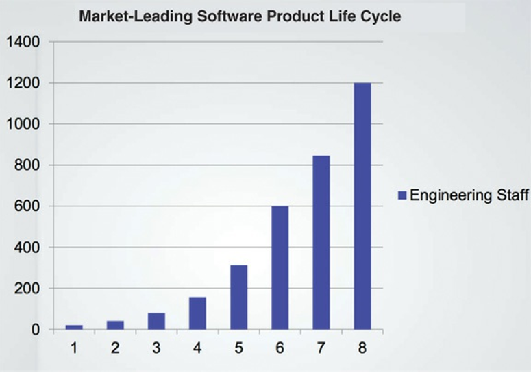
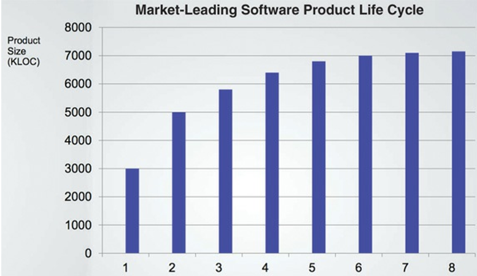
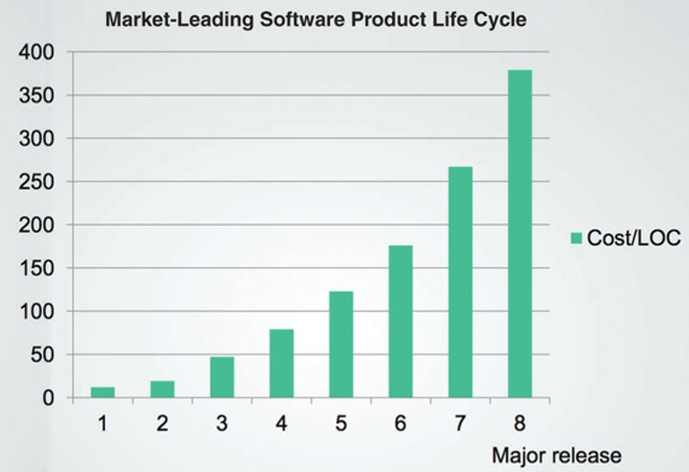
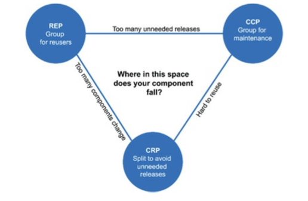
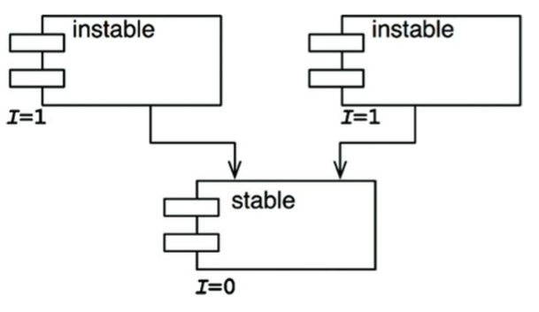
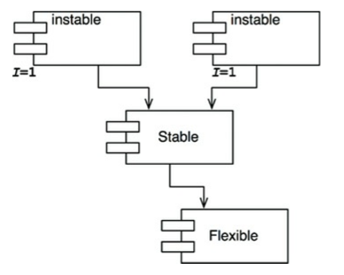
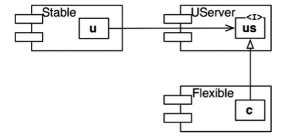
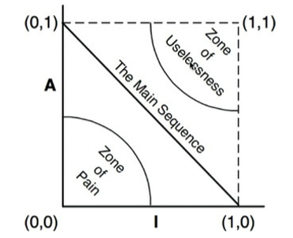
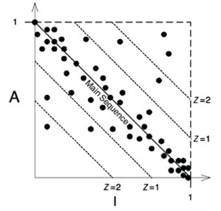
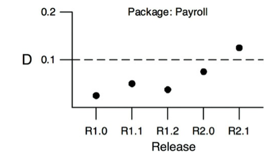

# 1부 소개
## 1장. 설계와 아키텍쳐란?

**아키텍쳐(architecture)와 설계(design)의 차이는?**

일반적으로 상위 수준의 결정사항을 아키텍처, 그리고 저수준의 세부사항에 대한 결정사항을 설계(디자인)라고 부르는 경향이 있다.
하지만, 그 경계는 뚜렷하지 않고 고수준에서 저수준으로 향하는 의사 결정의 연속성만 있을 뿐이다.

**SW아키텍쳐의 목표는?**

시스템을 만들고 유지보수하기 위한 비용을 최소화하는 것이다. 
즉, 좋은 설계란 고객의 요구 사항을 만족시키는데 드는 비용을 지속적으로 낮게 유지할 수 있고, 반대로 나쁜 설계란 비용을 지속적으로 증가 시킨다.

> *시사점 : 설계 문서 상에서는 HLD를 아키텍쳐, 그리고 LLD를 디자인(설계)으로 경계를 둔다. 이로 인해서 아키텍트는 HLD와 같은 상위 수준만을 중요하게 다룰 것이란 오해를 가질 수 있다.*

> *하지만, 실제 현장에서 아키텍트가 중요하게 다루어야 할 것은 현재와 미래의 개발 비용에 크게 영향을 주는 결정 사항이어야 한다.*

> *이것으로 부터 Architectually Significant Requirement의 진정한 의미는 그 추상화 수준과 상관없이 "구현, 테스트, 유지보수" 비용을 높일 가능성이 있는 모든 종류의 요구 사항으로도 정의할 수 있다*

> *이러한 관점은 아키텍쳐 요구사항을 선정할때 Non Local Change와 함께 분류 기준으로 추가 될 필요가 있다.*

**유지보수 비용 산출**

몇 가지 그래프를 통해서 비용 증가 추이로 부터 설계 품질을 간접적으로 평가 할 수 있다. 아래 그래프는 나쁜 설계로 인해서 해가 갈수록 생산성이 감소되고 비용은 증가하는 것을 보여 준다.

| 엔지니어링 직원 수 (X=제품 출시 시점, Y=직원수(비용))        |
| ------------------------------------------------------------ |
|  |

| 코드 라인수 (X=제품 출시 시점, Y=코드 라인수)                |
| ------------------------------------------------------------ |
|  |

| 코드 라인당 비용 (X=제품 출시 시점, Y=코드 라인당 비용)      |
| ------------------------------------------------------------ |
|  |

**개발자의 잘못된 과신**

* 바쁘니까 코드는 나중에 정리하고, 당장은 시장에 출시하는 것이 먼저다.
  * 그러나, 이전에 작성한 코드를 정리하는 일은 일어나지 않는다. 다음 기능, 또 다음 기능이 계속 기다리고 있기 때문이다.
* 지저분하게 코드를 작성하면 단기간에는 빠르게 갈수 있고, 장기적으로만 생산성이 낮아 진다.
  * 아니다. 단기적으로도 제대로 짠 코드가 더 빠르다. 이것은 시점에 상관없이 항상 그렇다.
* 망가진 시스템을 버리고 처음부터 다시 시작하여 전체 시스템을 재설계하면 좋아 질 것이다.
  * 아니다. 위와 같은 과신을 가진다면 재설계를 하더라도 원래의 프로젝트와 똑같이 엉망으로 만들 것이다.

 결국 빨리가는 유일한 방법은 처음부터 제대로 가는 것이다.

 >*시사점 : 우리 조직에서도 유지보수 비용 혹은 개발자 생산성을 산출해 볼 수 있다.*

 >*사례 : 코드 라인수와 비용(문제점 발생 수, 직원 수)*

 **결론**

 * 조직에 스며든 과신을 인지하여 방지하고 소프트웨어 아키테처 품질을 심각하게 고민할 필요가 있다.
 * 좋은 소프트웨어 아키텍처란 개발 및 유지보수의 비용을 최소화하고 생산성을 최대화 하는 것이다. 

>*시사점 : 아키텍쳐란 결국 개발, 테스트, 유지보수 비용을 최소화해서 개발 생산성을 극대화하기 위한 것이다.
즉, 아키텍쳐의 목적은 수율을 높이는 것이다*

---

## 2장. 두 가지 가치에 대한 이야기

**동작하는 소프트웨어가 중요한가? 아키텍쳐가 중요한가?**

소프트웨어 시스템을 동작하게 만드는 것이 중요한가? 아니면 소프트웨어 시스템을 더 쉽게 변경할 수 있도록 하는 것이 중요한가?
* 완벽하게 동작하지만, 변경이 불가능하다면 --> 요구 사항이 변경 될때 동작하지 않게 되어 쓸모가 없는 시스템이다.
* 동작은 하지 않지만, 변경이 쉽다면 --> 동작하도록 쉽게 만들 수 있다. 

변경이 불가능하다는 것은 변경 비용이 창출되는 수익보다 높은 경우를 말한다.

**아이젠하워 매트릭스**

중요성과 긴급성의 메트릭스로 업무를 우선 순위화 할 수 있다. 

* 기능 요구 사항
  * 긴급하고 중요하다.
  * 긴급하고 중요하지 않다.
* 아키텍쳐
  * 긴급하지 않지만 중요하다.
  

흔한 실수는 긴급하고 중요하지 않은 기능요구사항을 중요하다고 착각해서, 이로 인해 아키텍쳐 중요도가 떨어지는 것이다.

**아키텍처를 위한 투쟁**

아키텍트는 *뻔뻔함을 무릅쓰고*, 다른 이해관계자들(마케팅, 영업 등)과 싸워서 아키텍처를 보호해야 한다. 이를 통해 개발하기 쉽고, 변경하기 쉬운 확장성 있는 아키텍처를 만들어야 한다.

>*시사점 : 많은 사람들이 긴급한 것을 중요한 것으로 착각한다. 
그래서, 긴급하지만 중요하지 않은 요구사항으로 인해 더 중요한 아키텍처가 망가지곤 한다. (기술적 부채가 쌓인다.)*

>*기술적 부채는 단건으로 보면 사소해 보이지만 방만한 관리로 축적된다면, 미래에는 사소한 변경에도 큰 비용을 발생시키는 경직된 아키텍처를 초래한다. 변경에 유연한 아키텍처로 되돌리는 비용은 너무나 크기 때문에 기술적 부채의 악순환은 반복된다.*

>*아키텍트는 이러한 논리로 기술적 부채를 중요하지 않은 요구 사항보다 우위에 두도록 여러 이해 관계자들을 설득시켜야 한다.*

---------------------------------------------------------------------------------------------------------------------


# 3부 설계 원칙

SOLID 원칙은 함수와 데이터 구조를 클래스에 배치하고, 클래스들을 서로 결합하는 방법을 설명해준다. (OO의 클래스만을 지칭하는 것은 아니다.)
SOLID는 중간 수준의 소프트웨어, 즉 소스코드보다는 상위에서 적용되며 모듈과 컴포넌트 내부에서 사용되는 SW구조를 정의하는데 도움을 준다.

* SRP 단일 책임 원칙 Single Responsibility Principle : 소프트웨어 모듈은 변경의 이유는 단 하나여야만 한다. 
* OCP 개방-폐쇄 원칙 Open-Closed Principle : 기존 코드가 수정되기 보다는 반드시 새로운 코드를 추가하는 방식으로 설계되어 변경용이성이 높다.
* LSP 리스코프 치환 원칙 Liskov Substitution Principle : 상호 대체 가능한 구성요소를 이용해 소프트웨어 시스템을 만들 수 있으려면, 이들 구성요소는 반드시 서로 치환 가능해야 한다는 계약을 준수해야 한다.
* ISP 인터페이스 분리 원칙 Interface Segregation Principle : 소프트웨어 설계자는 사용하지 않는 것에 의존하지 않아야 한다는 원칙이다.

## 7장. SRP 단일 책임 원칙

SRP란 이름으로 인해 모든 모듈들이 단 하나의 일만해야 한다는 의미로 오해 할 수 있다. 그것은 함수 수준의 원칙이며 모듈 수준에 적합한 SRP 원칙에 대한 설명은 아래와 같다.

* 단일 모듈은 변경의 이유가 하나, 오직 하나뿐이어야 한다
* 하나의 모듈은 하나의, 오직 하나의 액터(집단)에 대해서만 책임져야 한다.

모듈이란 소스 파일이며, 혹은 함수와 데이터 구조로 구성된 응집된 집합니다. '응집된(cohesive)'는 SRP를 암시하며, 단일 액터를 책임지는 코드를 함께 묶어주는 힘이 바로 '응집력(cohesion)'이다.

이 원칙을 이해하기 위해 이 원칙을 위반하는 징후들을 살펴 보자

**징후 1. 우연한 중복**

단일 모듈이 여러 액터에 대해 책임질 경우 그들간의 코드 중복을 피하기 위해 공용 메서드를 만들게 되곤한다. 하지만 이것은 우연한 중복일 수 있다. 사실은 미래에는 변경되는 이유가 서로 달라서 한 액터의 요구로 변경된 공통 메서드가 다른 액터에게는 의도하지 않은 악영향을 줄 수 있다.

즉, 우연히 중복 된 것일 뿐 서로 다른 액터에게 의존하는 코드여서 미래에는 서로 다른 이유로 상이하게 변경될 수 있다.

이것은 서로 다른 액터가 의존하는 코드를 너무 가까이 배치했기 때문이다. SRP는 서로 다른 액터가 의존하는 코드를 서로 분리하라고 말한다.

>*시사점 : 일반적으로 코드 중복은 무조건 나쁜것으로 생각된다. 하지만, 이것은 우연한 중복일 수 있다. 즉, 미래에 서로 다른 이유로 변경될 가능성이 있는 중복 코드라면 공용화하지 말고 중복을 허용하는 것이 맞을 수 있다.*

**징후 2. 병합**

소스 파일에 다양하고 많은 메서드를 포함하고 특히 이들 메서드가 서로 다른 액터를 책임진다면 병합이 발생할 가능성이 높다. 특히 다른 책임 별로 다른 개발자나 조직이 담당한다면 잦은 병합과 상호 변경 영향으로 인한 위험을 유발한다. 

즉, 많은 사람이 서로 다른 이유로 동일한 소스 파일을 변경하는 경우에 해당되며, 이 문제를 벗어나는 방법은 서로 다른 액터에 의존적인 코드를 서로 분리하는 것이다.

>*시사점 : 단일 git에서 서로 다른 개발자가 수정을 한다면 SRP를 위반했을 가능성이 높다. git을 분리하거나, 최소한 개발자 별로 변경하는 파일을 분리해야 한다.*

**해결책**

이러한 문제점의 해결 책은 서로 다른 액터를 책임지는 코드를 서로 다른 클래스(파일)로 분리하고, 필요하다면 그들간에 간단한 데이터 구조 클래스(파일)을 만들어서 공유하는 것이다. 

이 경우에 다수의 클래스를 인스턴스화하고 추적해야 하는 단점이 있는데, 이를 위한 퍼사드 패턴이 있다.

퍼사드 패턴이란 다수의 클래스의 객체를 생성하고 요청된 메서드를 가지는 객체로 위임하는일을 책임지는 클래스를 만드는 것이다.

>*시사점 : 수많은 메소드를 가진 거대한 클래스가 있다면 메소드들을 응집력 있게 묶어서 다수의 클래스로 분리하여 작은 클래스로 변경하고,분리된 클래스들을 포함한 후에 위임하도록 변경해야한다.*

>*시사점 : 우연한 중복의 오류를 유발할 가능성이 높은 상속 관계를 지양하고, 포함 관계를 활용하자*

**결론**

SRP는 클래스(파일)수준의 원칙이다.하지만 상위 수준에서도 다른 형태로 등장한다. 컴포넌트 수준에서는 공통 폐쇄원칙, 아키텍처 수준에서는 아키텍처 경계(Architecture Boundary)의 생성을 책임지는 변경의 축이다.

## 8장. OCP 개방 폐쇄 원칙

일반적인 정의는 아래와 같다. 

* 소프트웨어 개체는 확장에는 열려 있어야하고, 변경에는 닫혀 있어야 한다는 것이다.  (즉, 개체의 행위는 확장할 수 있어야 하지만, 이때 개체를 변경해서는 안 된다.)
* 목표는 시스템을 확장하기 쉬운 동시에 변경으로 인해 시스템이 너무 많은 영향을 받지 않도록 하는 것이다.

실전적인 방법은 아래와 같다.

* A 컴포넌트에서 발생하는 변경으로 부터 B컴포넌트를 보호하려면 반드시 A컴포넌트가 B컴포넌트에 의존해야 한다. (A-->B)
* 책임에 맞게 컴포넌트 단위로 분리하고(SRP), 저수준 컴포넌트에서 발생한 변경으로 부터 고수준 컴포넌트를 보호할 수 있는 형태의 의존성 계측 구조가 만들어져야 한다. (저수준 --> 고수준)

OO기반에서는 의존성을 통제하기 위한 기법은 아래와 같다.

* 방향성 제어는 인터페이스를 이용해 의존성을 역전 시킨다.
* 컴포넌트 내부 요소와의 추이 종속성(transitive dependency)을 제거하기 위해 인터페이스를 이용하여 정보를 은닉한다.

>*시사점 : 고수준은 개념 보다는 저수준 개념이 확장 가능성이 높다는 전재가 필요하다. 일반적으로 상위 수준 정책(Usecase)과 세부사항이라는 기준으로 나누지만, 무엇이 고수준이고 저수준인지를 가르는 잦대 중 하나는 확장 가능성의 정도가 될 것이다.*

>*시사점 : 추이 종속성, 즉 A가 B에 의존하고 B가 C에 의존하면 A는 C에 의존한다는 용어는 외워 두면 커뮤니케이션 시에 좋을 듯 하다.*

## 9장. LSP 개방 폐쇄 원칙

단순히 상속을 사용하는 가이드가 아니라 소프트웨어 설계 원칙이다. 

상호 대체 가능한 구성요소를 이용해 소프트웨어 시스템을 만들려면, 이들 구성요소는 반드시 서로 치환 가능하도록 시스템을 유지해야 한다는 의미이다.

예를 들어 REST API를 이용해서 여러 URI 중 하나로 데이타를 전송하는 코드에서, 특정 URI의 데이타 스케마가 달라져야 하는 예외적인 처리를 한다고 가정하자.

소스 코드에서 if else로 분기해서 다른 URI들과 서로 치환 가능하지 않게 하기 보다는, URI를 키로 하는 DB를 구성하고 DB에서 스케마를 분리한다. 그리고, 소스코드는 분기 없이 DB의 내용에 따라 데이타를 구성한다. 이렇게 하면 URI들간에 여전히 치환 가능한 소스 코드를 유지 할 수 있다.

>*시사점 : 웹 오에스에서 상호 대체 가능한 구성요소를 이용한 시스템은 무엇인가? 광의적으로 해성하면 여러 클라이어트에게 API를 제공하는 모든 종류의 서비스와 앱이다. 그렇다면 치환 가능하지 않게 만든 흔적은 무엇인가? 특정 서비스, 앱에서 특정 uri로 분기를 친 소스코드들이다. 이런 코드를 찾아서 분기요소를 제거할 필요가 있다. 분기 제거 방법으로 분기 요소를 저장한 DB가 효율적일 것이다*

## 10장. ISP 인터페이스 분리 원칙
하나의 클래스가 여러 메소드를 제공할 경우 그중 하나만 변경이 되어도 클래스를 참조하는 다른 사용자 전부를 컴파일하고 재배포해야한다. 이것은, 메소드 별로 인터페이스를 만들어 사용자와 클래스의 정적 의존성을 디커플링하는 방법 등으로 해결할 수 있다.

이것은 소스코드에 포함된 선언문으로 소스코드 의존성이 발생하는 정적 타입의 언어에 의존한다. 

동적 타입의 언어에서는 발생하지 않으며, 상대적으로 결합도가 낮은 시스템을 구성할 수 있는 이유이다.

아키텍처 관점의 시사점은 불필요한 의존성을 피할 수 있게 설계하라는 의미이다. 이것은 SRP와 대치될 수 있는 개념 일 수 있다. 

악영향에 대해 예를 들어 보면, S -> F -> D 관계에서 S와F와 무관한 D의 변경점으로 인해서 S와 F를 재배포해야 할 수도 있다.  

---------------------------------------------------------------------------------------------------------------------

## 11장. DIP 의존성 역전 원칙

# 4부 컴포넌트 원칙
## 12장 컴포넌트

컴포넌트는 독립적으로 개발 및 배포 가능한 최소 단위이다. (다른 용어로 패키지이다.)
런타임에 플러그인 형태로 결합할 수 있는 동적 링크 파일을 말한다.

* 컴파일형 언어에서는 바이너리의 결합체
* 인터프리터형 언어에서는 소스코드의 결합체

13장은 컴포넌트 응집도와 관련된 세 가지 원칙으로 클래스나 모듈을 패키지에 할당하는 일을 도와준다.
14장은 컴포넌트 결합에 대한 세가지 원칙으로 컴포넌트간의 관계를 결정하는 일을 도와준다.

## 13장 컴포넌트 응집도

REP:재사용/릴리즈 등가 원칙 Reuse/Release Equivalence Principle : 재사용되려면 릴리즈 수준의 관리가 필요하다.
OCP:공통 폐쇄 원칙 Common Closed Principle : 동일 이유로 변경되는 코드가 여러 컴포넌트로 흩어지면 안된다는 말이다. 같은 컴포넌트로 폐쇄되어야 한다.
CRP:공통 재사용 원칙 (Common Reuse Principle) : 강하게 결합되어 있지 않은 모듈들은 동일 컴포넌트로 묶지 말라는 말이다. 그래서 해당 컴포넌트를 참조하는 다른 컴포넌트들에 불필요한 영향을 주지 말라는 말이다.

**REP : 재사용/릴리즈 등가 원칙**

재사용 단위는 릴리즈 단위와 같다. 즉, 재사용하려면 릴리즈 수준의 관리를 해야 한다.(릴리즈란 코드 유지보수, 버젼 관리, 통보, 지원 등을 포함한다.)

재사용 가능하다는 말은 코드가 유지보수되고 불 특정 재사용자들에게 통보,안정성,지원을에 대한 보장을 제공하는 추적 시스템이 있어야 한다. 단순히 개발자가 그냥 클래스 하나 달랑 만들고 재사용 가능하다고 주장해서는 안된다.

컴포넌트가 재사용된다는 것은 컴포넌트 내부 모듈들도 모두 재사용 될 수 있다는 것이다. 컴포넌트 내 모듈들은 모두 재사용되거나, 모두 그렇지 않아야 한다. 

>*시사점 : 웹 오에스 TV는 외부 업체(CP등)대상으로 플랫폼 단위의 재사용과 릴리즈만 존재한다. 컴포넌트 단위, 즉, 서비스,공유라이브러리가 존재하지만, 특정 내부 개발자들 대상으로 재사용되므로 릴리즈 수준의 관리를 하고 있지는 않다.만일 LGSI등 원격지와 협업할 경우 어느 정도 릴리즈 관리 수준을 높일 필요가 있을 것이다.*

**CCP : 공통 폐쇄 원칙**

동일한 사유로 동일한 시점에 변경되는 모듈들을 같은 컴포넌트로 묶어라. 다른 사유로 다른 시점에 변경되는 모듈들은 다른 컴포넌트로 분리하라.
그리하여, 컴포넌트에 어떤 변화에 대한 영향이 다른 컴포넌트에 영향을 미치지 않아야 한다.

즉, 함께 수정되는 모듈들을 여러 컴포넌트로 흩어 놓지 말고 같은 컴포넌트에 넣어서 변경을 패쇄하는 것이다. 즉, 변경을 단일 컴포넌트로 제한하여 변경할 컴포넌트 수를 최소화하는 것이다.

>*시사점 : 변경이 발생할때 마다 매번 함께 수정되는 컴포넌트들은 그 내무의 모듈들을 CCP에 입각하여 컴포넌트에 재배치 할 필요가 있다*

**CRP : 공통 재사용 원칙**

컴포넌트 안의 모듈들은 함께 재사용되어야 한다 하나를 재사용하면 나머지 모두도 재사용되어야 한다. (내부 모듈들은 강하게 결합되어 있어야 한다.) 그리하여, 컴포넌트 사용자들에게 필요하지 않은 것에 의존하게 강요하지 말라.

컴포넌트 내부 모듈들은 결합 되어있어야 한다. 그렇지 않은 모듈들은 동일한 컴포넌트에 위치시키면 안된다. 

>*시사점 : 컴포넌트 내부 모듈들이 결합되어 있지 않거나, 한 모듈의 변경이 다른 모듈에 영향을 주지 않는다면 분리해야 한다. 컴포넌트 내부 파일들의 의존관계를 조사하여, 의존성이 없다면 서로 다른 컴포넌트로 분리 하자*

**컴포넌트 응집도에 대한 균형 다이어그램**

REP와 CCP는 포함 윈칙으로 컴포넌트를 크게 만든다. 반면에 CRP는 배제 원칙으로 컴포넌트를 작게 만든다. 

균형 다이어 그램은 한 원칙을 포기했을 때 감수해야할 비용을 나타낸다.

* REP(재사용성을 위한 그룹) 약화 : 재사용이 어려움
* CCP(유지보수성을 위한 그릅) 약화 : 컴포넌트들의 변경이 너무 빈번함
* CRP(불필요한 릴리즈를 피하기 위한 분리) 약화 : 불필요한 릴리즈가 너무 빈번함.

아키텍트는 균형을 이루어야 하며, 초기에는 개발 가능성이 중요해서 CCP, 나중에는 REP가 중요해 질 수 있다.



>*시사점 : 응집도를 상충되는 두 가지 관점으로 봐라 볼수 있다. 변경되는 컴포넌트 수를 줄이기 위해 함께 변경되는 코드를 같은 컴포넌트로 모을 수록 컴포넌트가 커지게 되고, 반대로 서로 강하게 결합되어 있지 않은 파일들을 같은 컴포넌트로 모으면 빈번하게 릴리즈가 발생하여 사용자에게 불필요한 영향을 주므로, 강하게 결합되어 있지 않은 파일을 분리할 수록 컴포넌트는 작아지게 된다. 정답은 없다. 아키텍트의 인싸이트가 필요하다.*

>*시사점 : CCP와 CRP가 헷갈릴수 있는데 아래의 관점을 맴핑 할 수 있을 것이다.*

* CCP : 하나의 컴포넌트는 동일한 이유로 변경되어야 한다. 그로므로, 같은 이유로 함께 자주 변경되는 코드를 모아라~
* CRP : 하나의 컴포넌트는 하나의 액터에 대해서만 책임 져야 한다. 즉, 해당 액터에게 불필요한 영향을 주는 관련 없는 코드는 분리하라~

## 14장 컴포넌트 결합

**ADP : 의존성 비순환 원칙 (Acyclic Dependencies Principle)**

컴포넌트간의 의존성은 비순환 방향 그래프(DAG:Directed Acyclic Graph)를 유지해야 한다. 만일 순환 의존성(dependency cycle)이 발생하면 하기와 같은 문제가 발생 한다.

* 순환 관계에 있는 컴포넌트들은 사실상 하나의 거대한 컴포넌트가 되어 동일하게 릴리즈해야 한다. 그리하여, 해당 컴포넌트 개발자들은 모두 서로 얽매이게 된다. 예를 들어, E->A, B->A, C->B 관계에서는 E는 A에 대해서만 호환되면 되는데, A->C가 되어 순환 의존성이 생기면, E에 대한 정합 및 테스트를 위해 A,B,C가 모두 필요한 상황이 된다.
* 어떤 순서로 빌드하는 것이 올바른지 알수 없다. 특히, 바이너리를 사용하기 위해 선언문을 읽어야하는 정적 언어라면 끔찍한 문제가 일어 날 수 있다.

순환 의존성을 끊고 DAG를 유지하기 위한 주요 메카니즘은 아래와 같다.

1. 의존성 역전 원칙 DIP를 적용한다. 컴포넌트 내에 인터페이스를 만들고, 다른 컴포넌트가 상속 받는다.
2. 두 컴포넌트 모두 의존하는 새로운 컴포넌트를 만든다.

소프트웨어가 성장함에 따라의존성 구조는 흐트러지며, 또 성장한다. 

**하향식(top-down) 설계**

컴포넌트는 하향식으로 설계 할 수 없다. 시스템 초기 설계 대상이 아니며, 오히려 시스템이 성장하고 변경될 때 함께 진화한다.

컴포넌트 의존성 다이어그램은 기능을 표현하는 속성이 아니라 빌드 가능성과 유지보수성을 보여 주는 지도이다. 

* ADP원칙에 따라 순환 의존성을 관리하고, CCP원칙에 따라 함께 변경되는 요소를 최대한 하나의 컴포넌트에 배치한다. 
* 컴포넌트 의존성 그래프를 가다듬어, 자주 변경되는 컴포넌트로 부터 안정적이며 가치가 높은 컴포넌트를 보호한다.
* 시스템이 성장하면서 CRP원칙에 따라 컴포넌트를 재조합하고, 순환이 발생하면 ADP원칙을 적용한다

즉, 컴포넌트 의존성 그래프는 조금씩 흐트러지고, 또 성장한다.

>*시사점 : 웹 오에스에도 git간의 의존성 그래프를 관리할 필요가 있는가? 빌드 가능성은 관리되고 있다. 그렇다면 유지보수성 관점에서 관리할 필요가 있는가?*

**SDP : 안정된 의존성 원칙 Stable Dependencies Principle**

더 안정된 쪽으로 의존해야 한다는 원칙이다.

어떤 컴포넌트를 변경하기 쉽게 만들었다고 해도, 그것을 의존하는 컴포넌트가 많아진다면, 해당 컴포넌트도 점점 변경하기 어려워진다.

* 변경이 쉽지 않은 컴포넌트가 변경이 예상되는 컴포넌트에 의존하게 하지 말라. 
* 변경하기 어려운 컴포넌트가 변경하기 쉽게 만들어진 컴포넌트에 의존하지 말라.

안정성이란

* 다른 컴포넌트에 의존적이지 않고(독립적이며), 다른 컴포넌트를 많이 책임질 수록 안정적이다. 
* 다른 컴포넌트를 책임지지 않고, 다른 컴포넌트에 많이 의존적일 수록 불안정적이다.

안정성 지표

* Fan-in (안으로 들어오는 의존성) : 컴포넌트에 의존하는 외부의 모듈(클래스) 개수
* Fan-out (밖으로 나가는의존성) : 컴포넌트 외부 모듈(클래스)에 의존하는 내부 모듈(클래스) 개수
* I(불안정성) = Fan-out/(Fan-in+Fan-out) : [0,1] 범위로 I=0(최고 안정), I=1(최고 불안정)
  * I=0 : 책임을 지며, 독립적이다. 그러므로 변경하기 어렵다. 외부 영향으로 변경되지 않는다.
  * I=1 : 책임성이 없고, 의존적이다. 그러므로 쉽게 변경할 수 있다. 외부 영향으로 변경될 수 있다.

참고로, C++에서는 #include로 의존성을 찾는다.

I지표는 그 컴포넌트가 의존하는 다른 컴포넌트의 I보다 커야 한다 즉, 의존성 방향으로 갈수록 I지표 값이 감소해야 한다.

unstable(3) -> stable 이 이상적이며, 만일 unstable(3) -> stable->flexible 이 되면, flexible은 변경하기 힘들게 되며, stable은 자주 변경되는 flexible로 인해 영향을 받게 된다. 이를 해결하는 방법은 stable->interface <-(상속)flexible 로 의존 관계를 역전하는 것이다.










> *시사점 : 웹오에스에는 해당 git을 참조하는 외부 git의 파일 수, 혹은 해당 git이 외부git을 참조하는 내부 파일수로 표현할 수 있을 것이다. 단순히 참조 git 개수로 측정하는 것은 적합하지 않다. 동일하게 3개의 git을 참조하더라도 내부 파일 10개에서 참조하는 것과 내부 파일 1개에서 참조하는 것은 엄연히 다른 것이다. 다만, Luna API를 감싸는 adaptor를 사용하는 경우에는, 툴로 측정하기가 쉽지 않다.*

**SAP:안정된 추상화 원칙 Stable Abstractions Principle**

컴포넌트는 안정된 정도 만큼 추상화 되어야 한다. 

자주 변경하면 안되는 아키텍처나 고수준 정책은 안정된 컴포넌트(I=0)에 배치해야 하고, 변동성이 큰 소프트웨어, 즉 쉽고 빠르게 변경할 수 있는 소프트웨어는 불안정한 컴포넌트(I=1)에 포함해야 한다.

하지만, 고수준 정책을 안정된 컴포넌트에 위치시키면 아키텍처가 경직되므로 OCP원칙에 따라 추상화되어야 한다.

안정된 추상화 원칙이란 안정성과 추상화 정도 사이의 관계를 말한다.

* 안정된 컴포넌트는 추상 컴포넌트여야 하며, 이를 통해 안정성이 컴포넌트 확정을 방해하면 안된다.
* 불안정된 컴포넌트는 구체 컴포넌트여야 하며, 내부의 구체적인 코드를 쉽게 변경해야 한다. 

추상화 정도 측정하기

* Nc : 컴포넌트의 클래스 개수
* Na : 컴포넌트의 추상 클래스와 인터페이스 개수
* A: 추상화 정도. A=Na/Nc
  * A가 0이면 추상 클래스가 없다.
  * A가 1이면 추상 클래스만 있다. 

아래와 같이 A/I 그래프를 나타낼 수 있다.



* A를 Y축으로, I를 X축으로...
  * (0,1)은 최고로 안정적이며 추상적이다.
  * (1,0)은 최고로 불안정적이며 구체적이다.
* 고통의 구역 : (0,0) 근처
  * 매우 안정적인데, 구체적이다. 뻣뻣하다. 즉, 추상적이지 않아서 확장하기 어렵고, 안정적이어서 변경하기 어렵다.
  * 뎨표적인 예제로 데이타 베이스 스케마이며, 변동성이 매우 높은데 구체적이고 많은 컴포넌트가 의존해서, 변경되면 고통을 수반한다.
  * 반면에 유틸리티 라이브러리는 동일 포지션이지만 변동성이 없어서 해롭지 않다.
  * 그러므로, Z축으로 변동성을 포함한다면, 변동성이 높아야 고통스럽다.
* 쓸모 없는 구역 : (1,1) 근처
  * 최고로 추상적이지만, 어떤 컨포넌트도 의존하지 않는다. 즉, 쓸모가 없다.
  * 누구도 구현하지 않은체 남겨진 추상 클래스이다. 
* 주계열 : (1,0)과 (0,1)을 잇는 선분
  * 추상화 정도에 맞게 적당히 안정적이다. 혹은 적당히 구체적이다.
  * 그러므로 컴포넌트는 주계열 위에 있거나 가까이 있어야 한다.

주계열과의 거리



* D = |A+I=1|
  
  * D=0이면 주계열 바로 위에 있고, D=1이면 주계열로 부터 가장 멀리 위치한다.
  
* 통계적으로 분석한다면, 모든 컴포넌트의 평균과 분산을 구한다.
  * 주계열에 일치하도록 설계 되었다면 평균과 분산이 0에 가깝다.
  * 분산은 관리 한계(control limit)를 결정할 수 있다. 다른 컴포넌트에 비해 극히 예외적인 컴포넌트를 식별한다.
  * 산점도를 그려서 표준 편차 1인 영역을 벗어나는 컴포넌트를 면밀히 분석할 필요가 있다.
  
* Y=D, X=시간(리비젼)으로 해서 특정 컴포넌트가 특정 리비젼에서 D값이 나빠짐을 찾을 수 있다.

  

지표를 맹신할 필요는 없지만, 의미 있는 메시지를 도출해 낼 수 있다.

>*시사점 : C가 많이 사용되고, 컴퍼넌트간에 클래스의 직접적인 참조가 없는(luna call) 웹오에스에서 추상화 정도로 판단하는 것은 애매 하다. 대신에 아래와 같이 변동성으로 Y축을 사용해 보자*

* Na : 모든 파일 개수
* Nc : 변경되는 파일 개수(기간을 정해서..)
* C : 변동성 정도. C=Nc/Na
  * C가 0이면 모든 파일이 변경이 없다.
  * C가 1이면 모든 파일이 변경 된다.
* (0,1) : 안정적인 컴포넌트는 변경성이 없다.
* (1,0) : 불안정한 컴포넌트는 변경성이 크다.
  * 고통의 구역 : 안정적인데 변경성이 크다
  * 쓸모 없는 구역 : 불안정한데 변경성이 없다.
  * 주계열과의 거리(D) 표준 편차가 고통의 구역 방향으로 벗어난 컴포넌트는 변경된는 파일 수를 줄이도록 구조화한다.
  * 주계열과의 거리(D) 표준 편차가 쓸모 없는 구역 방향으로 벗어난 컴포넌트는 의존성을 줄이고 독립적으로 만들어서 안정성을 강화 시킨다. 

---------------------------------------------------------------------------------------------------------------------
# 5부 아키텍처
## 15장. 소프트웨어 아키텍처

소프트웨어 아키텍트는 코드에서 탈피하여 고수준의 문제에 집중해야 한다는 말은 거짓말이다. 프로그래밍에 지속적으로 참여하여 발생하는 문제를 경험해야만 프로그래머를 지원하는 것을 경험 할 수 있다.

소프트웨어 아키텍처란 시스템의 형태로 컴포넌트를 분할하는 방법, 분할된 컴포넌트를 배치하는 방법, 컴모넌트가 서로 의사소통하는 방식에 따라 정해진다.

아키텍처는 시스템의 동작 여부와와는 거의 관련이 없다. 형편없는 아키텍처도 그런데로 잘 동작한다. 

아키텍처의 주목적은 시스템의 생명주기를 지원하는 것으로, 시스템을 쉽게 이해하고, 쉽게 개발하며, 쉽게 유지보수 하고 쉽게 배포하게 하는 것이다. 

아키텍처의 주목표는 시스템의 개발 및 유지보수 비용을 최소화하고, 개발자의 생산성을 최대화 하는 것이다.

**개발**

아키텍처는 개발팀들이 시스템을 쉽게 개발할 수 있도록 뒷 받침해야 한다.

팀이 하나라면 모노리틱(monolithic) 시스템을 개발하여 아키텍처 제약사항을 피하려 할 것이다.

5개 팀이라면 신뢰할수 있는 안정된 인터페이스와 잘 설계된 컴포넌트 단위로 분리하지 않는다면 개발이 진척되지 않을 것이므로 아키텍처가 필요하다. 이 경우 5개 컴포넌트로 구성돌 가능성이 클 것이며, 하지만, 이러한 팀별 단일 컴포넌트 아키텍처가 시스템의 배포, 운영, 유지보수에 최적일 가능성은 없다.

**배포**

소프트웨어 아키텍처는 시스템을 단 한번에 쉽게 배포할 수 있도록 만드는데 그 목표를 두어야 한다.

배포 문제는 초기에 다루지 않는다면, 개발은 쉽게 했지만 배포는 어려운 아키텍처가 된다.

예를 들어 개발 초기에 독립적인 개발을 쉽게 하기 위해 마이크로서비스 아키텍처로 결정했는데, 배포할 시기에 지나치게 많은 마이크로서비스로인해 연결하고  작동순서를 결정하는 과정에서 큰 통합 비용이 발생할 수 있다.

**운영**

**유지보수**

유지보수는 소프트웨어 시스템에서 비용이 가장 많이 든다. 새로운 기능 개발과 그로인한 결함 개선 비용이 소모되된다. 

특히, 가장 큰 비용은 탐사(spelunking)이며, 시스템을 컴포넌트로 분리하고, 안정된 인터페이스로 격리하여 미래에 추가될 기능 추가를 열어두고, 의도하지 않은 결함의 위험을 줄인다. (탐사란 기존 SW에서 새로운 기능 추가나 오류를 개선하기 위해서 기존 SW를 파헤처서 어디를 고치고 어떤 전략을 사용할지 검토하는 비용이며, 이로인한 결함 가능성에 대한 위험 비용이다.)

**선택 사항 열어 두기**

시스템을 유연하게 유지하는 좋은 아키텍처는 상위 수준 정책을 세부사항으로 부터 격리하여, 세부사항에 대한 결정을 최대한 많이, 그리고 최대한 오랫동안 미룰 수 있어야 한다.

* 상위 수준 정책 : 시스템의 규칙과 절차, 유스케이스
* 세부 사항 : 정책에는 영향을 주지 않는 데이타베이스, 웹 시스템, 서버, 프레임워크, 통신 프로토콜 등

>*시사점 : 사실상 모든 디자인 패턴으로 하는 짓을 간명하게 요약하면 아래와 같다.*

1. 상위 수준 정책으로 부터 세부 사항을 격리하고 최대한 세부사항에 대한 결정을 미룰 수 있게 하는 설계 (세부 사항에 대한 선택 사항을 열어 두기)
2. 기존 코드 수정 없이 새로운 코드를 추가하여 확장활 수 있게 하는 설계(OCP)

>*시사점 : OCP는 확장가능성이 있는 코드는 열어두고, 경계를 그어서 나머지 코드를 변경으로 부터 보호하는 것이다. 그렇다면 확장 가능성은 어떻게 예측 가능한가? 사실상 예측 하기 힘들다. 그러므로 초기 시스템은 최대한 심플하게 만들고, 경험을 통해 확장용이한 구조로 진화시켜야 한다. (즉, 초기부터 확실하지 않는 화장가능성을 염두해 두고 불필요한 구조들을 덕지 덕지 만들어 시스템을 복잡하고 무겁게 만들면 안된다.) 그런데, 어떻게 초기 시스템을 심플하게 만들 수 있는가? 가장 유명한 실천법은 TDD이다. 테스트 코드를 먼저 만들고, 딱 그것이 동작하는 수준의 시스템만 만들게 유도하여 오버엔지니어링을 예방한다. 그 외에도 TDD는 테스트 대상 코드를 격리하기 위해 mock을 만들게 되면서, 자연스럽게 대상 코드를 외부로 부터 격리하는 구조가 만들어진다.즉, 작고 느슨하게 결합된 구조를 유도한다. TDD란 테스트가 아키텍처를 드라이브하여 좋은 설계를 유도하는 장점이 있다.*

>*시사점 : 정책과 세부 사항은 컨텍스트에 따라 상대적인 것이다. 테스트의 경우 테스트 코드가 정책이고 gmock은 세부 사항이다. 그러므로, cpptest등과 같은 다른 테스트 프레임워크를 사용하더라도 테스트 코드에 영향 없게 하여 저비용으로 테스트 프레임워크를 교체 가능하도록 선택 사항을 열어 두는 설계를 해야 한다. 그런데, 이렇게 선택 사항을 열어 두는 것도 결국은 비용이다.만일 gtest를 웹 오에스의 기술적 제약사항으로 선언할 수 있다면, 이것은 오버엔지니어링이 될 것이다. 그러므로 합의된 제약 사항은 컨선을 제거하여 아키텍처를 단순하게 유지하게 하는 아키텍트의 강력한 도구이다. 즉, 합의된 제약 사항이 많을 수록 아키텍처는 단순해 진다.*


## 16장 독립성

아키텍처는 시스템의 유스케이스, 운영, 개발, 배포를 지원해야 한다.

**유스케이스**

시스템의 아키텍처는 시스템의 의도(유스케이스)를 지원해야 한다. 

유스케이스가 아키텍처에 영향을 주지는 않지만, 좋은 아키텍처는 시스템이 지닌 의도를 명확하게 하여 아키텍처 수준에서 알아 볼 수 있게 만드는 것이다.

* 예를 들어 장바구니 어플리케이션이 좋은 아키텍처를 가졌다면, 개발자가 일일이 찾아 헤메지 않아도 시스템의 최상위 수준에서 장바구니임을 알아 볼 수 있어야 한다. - 주요 모듈이 아키텍처에서 핵심적인 자리를 차지하고, 분명한 이름을 같는다.

**운영 (Operation)**

아키텍처는 유스케이스에 걸맞는 시스템의 처리량과 응답시간을 보장해줘야 한다. 

이를 위해 단일 프로세스 혹은 다중 쓰레드, 다중 프로세스, 다중 프레세서 수준에서 병렬처리 되도록 설계 될 수 있다. 좋은 아키텍처는 이 또한 선택 사항으로 열어 둔다. 각 컴포넌트를 격리하고 그들 간의 통신 방식을 특정한 형태로 제한하지 않는다.

**개발 (Development)**

콘웨이의 법칙에 따라 아키텍처는 그 조직의 의사소통 구조를 따른다. 좋은 아키텍처는 각 팀이 서로간의 간섭없이 독립적으로 개발할 수 있도록 보장한다.

잘 격리되어 독립적으로 개발 가능한 컴포넌트 단위로 시스템을 분할하고, 이들 컴포넌트를 독립적으로 개발 할 수 있는 팀에 할당 할 수 있다.

**배포 (Deployment)**

좋은 아키텍처는 '즉각적인 배포(immediate deployment)', 즉, 시스템이 빌드 후 즉각 배포할 수 있도록 지원해야 한다. 

시스템은 컴포넌트 단위로 적절하게 분할되고 격리되어 있고, 마스터 컴포넌트가 하나의 시스템으로 묶고, 각 컴포넌트가 올바르게 구동하고 통합하고 관리해야 한다.

**선택사항 열어 놓기 (Keeping Options Open)**

현실에서 우리는 모든 유스케이스를 알수 없으며, 운영에 따르는 제약사항, 팀 구조, 배포 요구 사항도 알지 못한다. 혹시 안다고 하다라도 시스템 생명주기의 단계를 거침에 따라 이 사항들은 반드시 변해 간다. 

좋은 아키텍처는 선택사항을 열어 둠으로써, 향후 시스템에 변경이 필요할 때 어떤 방향으로든 쉽게 변경할 수 있어야 한다.

**계층 결합 분리(Decoupling Layers)**

아키텍트는 모든 유스케이스를 알지 못하지만, 시스템의 의도는 분명히 알고 있다. 그러므로 단일 책임 원칙(SRP)와 공통 폐쇄 원칙(CCP)를 이용하여 동일한 이유로 변경되는 것은 모으고, 서로 다른 이유로 변경되는 것은 분리한다.

하나의 유스케이스 내에서도 서로 다른 이유와 다른 속도로 변경되는 UI, 애플리케이션에 특화된 업무 규칙, 애플리케이션과는 독립된 업무 규칙, 데이타베이스 등으로 분리할 수 있다.

즉, 시스템은 서로 결합되지 않은 수평적인 게층으로 분리 될 수 있다.

**유스케이스 결합 분리(Decoupling Usecases)**

유스케이스도 서로 다른 이유와 다른 속도로 변경된다.(주문 입력 시스템과 주문 삭제 시스템은 서로 다른 이유로 변경된다.)

유스케이스는 시스템의 수평적인 계층 구조를 가로질러서 자른 수직으로 좁다란 조각이다. UI, 애플리케이션 특화 업무 규칙, 애플리케이션과 독립된 업무 규칙, 데이타베이스의 일부 기능을 모두 가지게 된다.

유스케이스와 계층적으로 분리하면, 시스템의 맨 아래 계층까지 수직으로 내려가며 유스케이스들이 각 계층에서 겹치지 않게 된다.

시스템에서 서로 다른 이유로 변경되는 요소들의 결합을 분리하면, 각 계층에서 유스케이스 별로 서로 다른 관점(aspect)을 사용하게 되어 새로운 유스케이스를 추가하더라도 기존 유스케이스에 영향을 거의 주지 않는다. 

* 관점 지향 설계(Aspect-Oriented Programming, AOP) : 횡단 관심사(cross cutting concern)를 분리하여 모듈화를 높여, 기존 코드 수정 없이 추가하는 방식이다. 횡단 관심사의 주요 예제는 예외 처리, 로깅, 인증, 트랜잭션 등이 있다.

>*시사점 : 전부는 아니지만, 가능한 유스케이스는 관점을 분리하여 격리할 필요가 있다 예를 보이스, IoT와 같이 앱,서비스, 라이브러리 등 각 층내에서 분리 할 수 있다면, 새로운 유스케이스를 추가할때 상호간의 변경영향이 적을 것이다. 이렇게 아키텍처를 구성한다면, 역콘웨이 법칙에 따라 특정 유스케이스 관점으로 조직을 구성할 수 도 있을 것이다.*

**결합 분리 모드(Decoupling Mode)**
유스케이스에서 서로 다른 관점이 분리되었을 때 운영에도 도움이된다.
* 높은 처리량이 필요한 유스케이스와 낮은 처리량이 필요한 유스케이스도 분리되었을 가능성이 높고, 높은 처리량의 유스케이스를 여러 서버로 복제하여 실행 할 수 있다.
* UI와 데이타베이스를 업무규칙과 다른 서버에서 실행 할 수 있다.

이러한 이점을 살리기 위해서 절적한 결합 분리 모드를 선택 할 수 있어야 한다. 예를 들어 컴포넌트들이 서로 다른 서버에서 실행 되어야 한다면, 마이크로 서비스 수준의 결합 분리 모드를 선택 해야 한다. (물론, 뛰어난 아키텍처는 컴포넌트간 통신 방법을 특별한 것으로 제한하지 않고 선택사항을 열어 둔다.)

**개발 독립성(Developmentability)**

컴포넌트가 완전히 분리된다면, 팀 사이의 간섭을 줄이고 개발 독립성을 보장할 수 있다. 즉, 유스케이스와 계층의 결합이 분리되면, 기능 팀, 계층 팀, 또 어떠한 형태의 팀이라도 아키텍처는 조직 구조를 뒷받침해 줄 것이다.

**배포 독립성(Deploymentability)**

유스케이스와 계층의 결합이 분리되면, 배포측면에서 도움을 주며, 실제로 결합이 제대로 분리되었다면 실행 중인 시스템에서도 계층과 유스케이스를 교체 할 수 있다. (hot-swap) 시스템의 나머지는 그대로 둔 채 새로운 공유 라이브러리, 서비스 몇 개를 추가하는 단순한 일이 된다.

* hot-swap : 운영 중인 시스템 동작에 영향 없이 런타임에 공유라이브러리나 서비스를 추가할 수 있는 능력

>*시사점 : 결국 부분 업데이트는 펌웨어에서 특정 유스케이스의 관점으로 부분 시스템을 분리하고 특정 팀에 배치하는 방법이 적합해 보인다. 시간이 갈수록 펌웨어는 경량화 되고, 분리된 기능은 빠르게 배포될 것이다. *

**중복(Duplication)**
중복에는 두 가지 유형이 있다.

* 진짜 중복(True duplication) : 한 인스턴스가 변경되면, 동일한 변경을 그 인스턴스의 모든 복사본에 반드시 적용해야 한다. 이러한 중복은 제거되어야 한다.
* 우발적 중복(false or accidental duplication) : 우연히 중복으로 보이는 두 코드가 서로 다른 시점에 다른 이유로 발전한다면, 두 코드는 진짜 중복이 아니다. 우발적 중복 코드를 통합하면, 나중에 다시 분리하는 비용을 들 것이다.

유스케이스를 수직으로 분리할때나, 계층을 수평으로 분리할때 우발적 중복에 주의해야 한다. 

* 예를 들어 유스케이스로 분리할때 두 UI가 비슷해 보일 수 있는데, 서로 다른 시점에 다른 원인으로 변경 될 수도 있다.
* 예를 들어 계층적으로 분리할때 UI의 뷰 모델과, 데이타 베이스의 레코드가 비슷해 보여서, 뷰 모델 생성 없이 데이타베이스에서 UI로 데이타를 전달하려는 것도 우발적 중복일 수 있다. 그냥 뷰 모델을 만드는 것이 맞다.

**결합 분리 모드(다시)**

계층과 유스케이스로 결합을 분리하는 방식은 소스 코드 수준, 바이너리 코드(배포 수준), 실행 단위(서비스) 수준으로 분리 할 수 있다.

* 소스 수준 분리 모드(Source Level)
  * 소스 코드 모듈 사이의 의존성을 제어하여 하나의 모듈이 변하더라도 다른 모듈을 변경하거나 재컴파일하지 않도록 만들 수 있다.
  * 모든 컴포넌트가 같은 주소 공간(단일 프로세스)에서 실행되고, 서로 통신할 때는 함수 호출이며, 메모리에 하나의 실행 파일만 로드된다.
  * 흔히, 모노리틱 구조라고 한다.

* 배포 수준 분리 모드(Deployment Level)
  * jar파일, DLL파일, 공유 라이브러리와 같이 독립저그오 배포 가능한 단위들의 의존성을 제어하여, 한 모듈의 소스코드가 변경되더라도 다른 모듈을 재빌드하거나 재배포하지 않도록 만들 수 있다.
  * 많은 컴포넌트가 같은 주소 공간(단일 프로세스)에 상주시켜 함수 호출하거나, 혹은 서로 다른 프로세스에 상주시켜서 IPC를 통해 통신한다.

* 서비스 수준 분리 모드(Service Level)
  * 의존 수준을 데이타 구조 단위로 낮추어서, 네트워크 패킷을 통해서만 통신하도록 만든다.
  * 이를 통해 모든 실행 가능한 단위는 소스와 바이너리 변경에 대해 서로 완전히 독립적이게 된다. (like 마이크로 서비스)
  * 즉, 컴포넌트간에 가장 강력한 경계이다.
  
* 서비스 수준 분리 단점
  * 개발 비용이 많이 들고, 컴포넌트가 상대적으로 큰 단위(coarse-grained)로 분리된다. 충분히 작은 단위로(fine-grained)로 분리될 가능성은 없다.
  * 시스템 자원 측면(메모리, 계산량 등)에서 비용이 많이 든다. 어쩌면 낭비일 수 있다.
  

좋은 아키텍처는 분리 결함 모드를 선택사항을 열어 두어서, 운영과 배포 규모에 따라 가장 적합한 모드를 선택하게 해준다.

>*시사점 : 웹오에스는 배포 수준 분리 모드와 서비스 수준 분리 모드가 하이브리드 형태로 섞여 있다. 또한 분리 모드를 선턱새항으로 열어 두지 않고 제한했다. (물론, 어떤 서비스는 내부에 어답터 층을 두어서 통신 방식을 열어 두었다.)*

>*시사점 : 만일, 루나 버스가 서비스간의 구체적인 네트웍 통신을 열어 두게 하고, 각 서비스가 비표준 공유 라이브러리에 의존하지 않는다면, 쉽게 서비스 수준의 분리 모드를 지원할 수 있을 것이다. 예를 들어 다른 서비스 영향 없이, configD를 디바이스가 아닌, 서버에서 실행하도록 쉽게 변경 할 수 있다.*


## 17장 경계 : 선 긋기

아키텍처는 선(경계:Boundary)을 긋는 기술이며, 프로젝트 초기에 긋는 선은 가능한 오랫동안 결정을 연기하기 위한 것이다. 

즉, 구체적인 세부사항이 핵심 업무 로직을 오염시키지 못하게 하기 위한 것이다. 세부 사항에 대한 이른 결정은 피해야 한다.

결국 좋은 아키텍처란 세부사항에 대한 결정을 가능한 한 최후의 순간에 내릴 수 있게 해주며, 결정에 따른 영향이 크지 않게 만든다.

**플러그인 아키텍처**
세부 사항들인 DB(데이타베이스), GUI(사용자 인터페이스)로 부터 업무 규칙을 분리하고 독립적으로 유지해서 손쉽게 플러그인 아키텍처를 만들 수 있다. 

예를 들어 플러그인 형태의 사용자 인터페이스는 웹 기반, 클라이언트/서버 기반 등 수 많은 종류로 확장할 수 있다. 

반면에 업무 규칙은 DB나 GUI변경으로 인해 망가지지 않고 보호된다. 만일 업무 규칙과 데이타 베이스가 서로 다른 팀이라면, 이것은 팀간의 관계에도 적용된다. 

경계는 변경의 축(axis of change)이 있는 지점에 그어진다. 경계 한쪽에 위치한 컴포넌트는 경계 반대편의 컴포넌트와는 다른 속도로, 그리고 다른 이유로 변경된다.


*시사점 : 결론적으로 시스템을 컴포넌트 단위로 나눈 후에, 서로 다른 시점에 다른 이유로 변경되는 변경의 축으로 아키텍처 경계선을 긋고, 저수준 세부사항에서 고수준의 추상화를 향해 의존관계를 맺는다..*

*시사점 : 컴포넌트가 서로 다른 팀일 경우 "누가  혁신적으로 변경할 것인가" 혹은 "누가 안정적으로 유지할 것인가"에 따라서, 그에 맞는 컴포넌트를 배치해야 한다. 혁신적으로 변경하는 팀에는 개발 독립성을 확보하기 위해 변경가능성이 높고 fan out이 높은 모듈을 배치하고, 안정적으로 유지하는 팀에게는 변경가능성이 작고,  fan in이 높은 모듈을 배치한다.*

*시사점 : 조직을 경계로 서로 다른 시점에 다른 이유로 변경되는 컴포넌트가 할당 되어야 한다.*


## 18장 경계 : 경계 해부학


## 19장 정책과 수준

소프트웨어 시스템이란 정책의 기술이며, 큰 정책은 여러 개의 작은 정책으로 분할된다. 

동일한 이유로 동일한 시점에 변경되는 정책은 동일한 수준에 위치하고 동일한 컴포넌트에 속해야 하며, 다른 이유로 다른 시점에 변경되는 정책은 다른 수준에 위치하고, 다른 컴포넌트에 속해야 한다 

좋은 아키텍처는 컴포넌트의 '수준'에 따라 비순환 방향 의존성(directed acyclic graph)을 가지며, 저수준 컴포넌트가 고수준 컴포넌트에 의존하도록 설계되어야 한다.

**수준(level)**

'입력과 출력까지의 거리다'

* 입력과 출력으로 부터 멀리 위치할 수록 상위 수준 정책이다. 
* 입력과 출력에 가까울 수록 하위 수준 정책이다. 

아래 그림에서 입력과 출력으로 부터 가장 멀리 떨어져 있는 '번역(Translate)'이 최고 수준의 컴포넌트이다. 소스 코드 의존성은 그 수준에 따라 의존성을 가지며, 데이타(실행) 흐름과 같지 않다. 


아래 그림에서도 입력과 출력으로 부터 가장 거리가 먼 Encrypt 이며, 최상위 수준의 정책으로 경계가 묶이고, 경계를 횡단하는 의존성은 모두 경계 안쪽을 향한다. 


상기 관계를 컴포넌트로 표현하면 아래와 같다.


단일 책임 원칙, 개발 폐쇄 원칙, 공통 폐쇄 원칙, 의존성 역전 원칙, 안정된 의존성 원칙, 안정된 추상화 원칙을 모두 따른다.

- 단일 책임 원칙에 따라 같은 시점에 같은 이유로 변경되는 정책을 함께 묶는다. 
- 입력과 출력으로 부터 멀리 떨어진 상위 수준 정책은 '덜 빈번하며', 보다 ''더 중요''하다.
- 입력과 출력 정책은 '더 긴급성'을 가지나 '덜 중요'하다.
- I/O출력이 자주 변경되더라도 중요한 암호화 정책은 영향 받지 않는다. 

*시사점 : 주하입마에 빠지지 않으려면, 근원적으로는 이렇게 해석  될 필요가 있다.  "확장가능성이 높은 컴포넌트가 확장 가능성이 낮은 컴포넌트에 의존해야 한다. 대체로 입/출력에 가까운 하위 수준의 컴포넌트들이 확장 가능성이 높고, 입/출력에서 거리가 먼 상위 수준의 컴포넌트들이 확장 가능성이 낮은 경향이 있다.*

*시사점 : 또 다른 해석으로, 변경용이성이 높은(fan out) 컴포넌트가 변경용이성이 낮은(fan in) 컴포넌트에 의존해야 한다.*


## 20장 업무 규칙(Business Rules)

업무 규칙은 사업적인 수익과 비용의 규칙 또는 절차다. 컴퓨터상으로 구현했는지와 상관 없고, 심지어 사람이 수동으로 직접 수행하더라도 마찬가지다.

**엔티티** (Entities)

* 핵심 업무 데이타(Critical Business Data) : 시스템으로 자동화되지 않아도 존재하는 데이타. 즉, 수동 환경에서도 사용할 수 있다.
* 핵심 업무 규칙(Critical Business Rule) : 사업의 핵심이며, 자동화하는 시스템이 없어도 존재함.
* 핵심 업무 데이타와 핵심 업무 규칙을 구체화한것이다. 수많은 다양한 애플리케이션에서 사용될 수 있도록 일반화되어 있다.
* 자동화 시스템의 나머지 모든 고려사항과 분리시킨다.

**유스케이스(Usecases)**

- 자동화된 시스템의 요소로 존재해야만 의미가 있다. 단일 애플리케이션에 특화되어있다.
- 자동화된 시스템이 사용되는 방법을 설명한다. 
- 사용자에게 제공해야 하는 입력, 사용자에게 보여줄 출력, 그리고 처리 단계들을 기술한다.
- 유스케이스만 봐서는 웹을 통해 전달되는지, 콘솔 기반인지 등을 구분할 수 없다.

**요청 및 응답 모델 (Request and Response Models)**

- 유스케이스는 입력을 받아서 출력 데이터를 생성한다. 
- 이들 데이터 구조는 어떤것에 의존하지 않는다. (웹인지, 콘솔인지...)
- 즉, 요청 및 응답 모델은 독립적이어야 한다.
- 엔티티 객체를 가르키는 참조를 요청 및 응답 데이타 구조에 포함하지 마라
  - 두 객체는 완전히 다른 이유로 변경될 것이다. 
  - tramp data : 함수에서 함수로 전달되는 데이타, 전달 경로의 앞쪽 함수에서는 해당 데이터를 전혀 사용하지 않는다.


## 21장 소리치는 아키텍처 (SCREAMING ARCHITECTURE)

주택 아키텍처가 "나 집이야"라고 소리치듯이, 도서관 아키텍처가 "나 도서관이야" 라고 소리 치듯이, 상위 수준의 디렉터로 구조, 최상위 패키지에 담긴 소스 파일을 보고 어떤 시스템인지 알 수 있어야 한다.

**아키텍처 테마**

 "Use Case Driven Appoach", 소프트웨어 아키텍처는 시스템의 유스케이스를 지원하는 구조다. 즉, 아키텍처는 시스템의 유스케이스에 대해 소리처야 한다. 

아키텍처는 프레임워크 중심으로 만들지 말고, 유스케이스 중심으로 만들어야 한다. (프레임워크는 도구일 뿐이다.)

**아키텍처 목적**

좋은 아키텍처는 유스케이스에 중점을 두고, 프로엠워크나 도구 환경 등 세부 사항은 선택 사항으로 열어 둔다.

**테스트 하기 쉬운 아키텍처**

아키텍처가 유스케이스에 중점을 두고 엔터티를 보호하여, 프레임워크의 의존성 없이 단위 테스트 할 수 있다.

**결론**

아키텍처는 시스템의 유스케이스를 얘기해야 하며, 시스템에 적용한 프레임워크에 대해 이야기해서는 안된다.


## 22장 클린 아키텍처

육각형 아키텍처(Hexagonal Architecture), 포트와 어댑터(Ports and Adapters), DCI(Data, Context and Interaction), BCE(Bounded-Control-Entity) 등의 아이디어들의 목표는 소프트웨어를 계층으로 분리하여, 관심사의 분리(separation of concerns)를 하는 것이다.

* 프레임워크 독립성 : 아키텍처는 프레임워크에 의존하지 않는다.
* 테스트 용이성 : 업무 규칙은 프레임워크에 의존 없이 단위 테스트 가능하다.
* UI독립성 : 업무 규칙을 수정하지 않아도, UI를 쉽게 변경할 수 있다.
* 데이터베이스 독립성 : 업무 규칙을 수정하지 않아도 데이타 베이스를 쉽게 교체 할 수 있다.
* 모든 외부 에이전시에 대한 독립성 : 업무 규칙은 외부 세계와의 인터페이스에 대해 전혀 알지 못한다.


**의존성 규칙** (Dependency Rule)

- 안쪽 원은 상위 수준 정책이고, 바깥 원은 메카니즘이다.
- 소스 코드 의존성은 반드시 안쪽으로, 고수준의 정책을 향해야 한다.
  - 내부 원은 외부 원의 어떤 코드도, 데이터도 사용하면 안된다.
  - 외부 원에 위치한 어떤 것도 내부 원에 영향을 주면 안된다.

**엔티티 (Enterprise Business Rules)**

- 전사적인 핵심 업무 규칙(Eenterprise-wide Critical Business Rules), 특정 애플리케이션에서 재사용, 수동으로도 존재함.

**유스케이스 (Application Business Rules)**

- 특정 애플리케이션 특화된 업무 규칙, 엔티티로 들어오고 나가는 데이타 흐름 조정

**인터페이스 어댑터 (Interface Adapters)**

- 데이터를 유스케이스와 엔티티의 형식에서 외부 에이전시(DB, 웹)의 형식으로 변환한다.
  - controller는 외부에서 입력된 데이타를 usecase에게 전달한다. (실행 흐름 관점)
  - presenters는 Use Cases로 부터 전달 받은 데이타를 외부로 전달한다.  (실행 흐름 관점)

**프레임워크와 드라이버 (Frameworks & Drivers)**

- 세부 사항으로, 안쪽원과 통신하기 위한 접합 코드 외에는 특별히 더 작성해야할 코드가 많지 않다.

**원은 네 개여야만 하나?**

* 원은 몇 개라도 상관없다. 안쪽일 수록 추상화와 정책 수준이 높아지고, 바깥쪽 일 수록 저수준의 구체적인 세부사항이면 된다.

**경계 횡단하기(CROSSING BOUNDARIES)**

- 그림에서 경계를 횡단하는 실행 흐름과 소스 코드 의존성이 반대이다. 즉, 아키텍처 경계를 횡단할때 동적 다향성 기법(인터페이스 상속)을 통해 실행 흐름에 상관없이 소스 코드 의존성을 통제 할 수 있다.

**경계를 횡단하는 데이터는 어떤 모습인가? (WHICH DATA CROSSES THE BOUNDARIES)**

- 경계를 횡단하는 데이타는 간단한 구조로 이루어져 있다. 
- 경계를 가로지르는 데이터를 전달 할 때, 데이터는 항상 내부의 원에서 사용하기 가장 편리한 형태를 가져야 한다.
  - 외부의 데이타 베이스가 사용하는 형태를 그대로 유스케이스에 전달 하면 안된다. 유스케이스가 데이타 베이스에 의존 관계를 가진다.

*시사점 : Layer 아키텍처 패턴에서 레이어 간의 경계를 가로지르는 데이타를 변형하는 것이 귀찮아서 외부의 형식을 bypass하는 경우가 있다. 특히, 레이어간의 Cross Cutting 변경이  자주 발생할 수록, 귀찮아 진다. 이런 경우에 어쩌면 레이어간의 추상화 수준이 달라서 생긴 문제일 수 있다.*

**전형적인 시나리오**


## 23장 프리젠터와 험블 객체 (PRESENTERS AND HUMBLE OBJECTS)

**험블 객체 패턴(THE HUMBLE OBJECT PATTERN)**

- 테스트 하기 어려운 행위와 테스트 하기 쉬운 행위로 나누고, 테스트 하기 어려운 행위를 험블 객체에 옮긴다.
- 예를 들어 GUI는 화면상에 적절하게 표시 되어 있는지 테스트 하는 것은 어렵다. 험블 객체 패턴을 사용하면, 프레젠터와 뷰로 분리할 수 있다.

**프레젠터와 뷰(PRESENTERS AND VIEWS)**

- 뷰는 험블 객체이고 테스트하기 어렵다.가능한 한 간단하게 유지 한다.  데이터를 GUI로 이동할 뿐이다.
- 프리젠터는 테스트하기 쉽다. 데이터를 받아서 화면에 표현할 수 있는 포멧으로 변경한다. 
  - 버튼의 문자열 이름과, 활성화 플러그 타입 등을 뷰 모델에 저장한다.

**테스트와 아키텍처**

험블 객체 패턴으로 행위를 테스트하기 쉬운 부분과 테스트하기 어려운 부분으로 분리하여 아키텍처 경계를 정의한다.

**데이타베이스 게이트웨이**

- 유스테이스 인터랙터와 데이타베이스 사이에는 데이터베이스 게이트웨이가 위치 한다.
- 게이트웨이는 다형적 인터페이스로 애플리케이션이 데이터베이스에 수행하는 생성, 조회, 갱신, 삭제 작업과 관련된 모든 인터페이스 포함한다. (ex  :UserGateway.getLastName)
- 게이트웨이의 실제 구현체는 험블 객체로 데이타베이스 계층에 위치하여, SQL을 사용하거나 한다. 
- 유스케이스를 테스트 하기 위해서 게이트웨이 스텁으로 적당히 교체할 수 있다.

**데이타 맵퍼**

- 관계형 데이터베이스 테이블로 부터 가져온 데이터를 구조에 맞게 담아준다.
- 데이타 베이스 계층이며, 일종의 험블 객체이다.

**서비스 리스너**

- 외부로 부터 데이터를 수신하는 경우 서비스 리스너 인터페이스를 경계로 험블 객체를 만들 수 있다.
- 외부로 데이터를 전달 하는 경우에도 가로지르는 경계에 험블 객체를 만들 수 있다.

**결론**

- 각 아키텍처 경계마다 경계 가까이에 험블 객체 패턴이 있다.
- 경계를 넘나드는 통신은 거의 모두 간단한 데이터 구조를 수반할 때가 많고, 대개 그 경계는 테스트하기 쉬운 것과 어려운 것으로 분리 된다. 
- 그리고, 이러한 경계에서 험블 객체 펴턴을 사용하면, 전체 시스템 용이성을 크게 높일 수 있다.


## 24장. 부분적 경계 (PARTIAL BOUNDARIES)

완벽한 아키텍처 경계 (Full-fledged architectural boundaries)는 비용이 많이 든다. 

- 쌍방향의 다형적 Boundary 인터페이스 (InputBoundary, OutputBoundary)
- Input, Output 데이타 구조
- 두 영역을 독립적으로 컴파일하고 배포할수 있게 컴포넌트로 격리하는데 필요한 모든 의존성 관리

애자일 진영의 사람들은 이런 선행적인 설계(anticipatory design)보다는 YAGNI (You Aren't Going to Need It) 원칙을 좋아한다. 그렇다면 부분적 경계를 구현해 볼 수 있다.

**마지막 단계 건너뛰기 (SKIP THE LAST STEP)**

부분적 경계의 하나의 방법으로 독립적으로 컴파일하고 배포할 수 있는 컴포넌트를 만든 작업을 모두 수행 한후에 단일 컴포넌트로 컴파일해서 배포 하는 것이다. 

다수의 컴포넌트를 관리하는 작업, 추적을 위한 버전 번호, 배포 관리 부담은 없다. 다만, 컴포넌트 사이의 구분이 약화되어 의존성이 잘못된 방향으로 선을 넘을 가능성이 높다.

**일차원 경계 (ONE-DIMENSIONAL BOUNDARIES)**

양방향 격리는 비용이 높다. Strategy 패턴을 사용하여 단방향으로 격리한다. 단, 점선 화살표 처럼 매우 빠르게 붕괴될 가능성이 있다.


**퍼사드 (FACADES)**

경계는 Facade 클래스로만 간단히 정의 한다. Facade클래스에는 모든 서비스 클래스를 메서드 형태로 정의하고, 서비스 호출이 발생하면 해당 서비스 클래스로 호출을 전달한다. 하지만, Client가 이 모든 서비스 클래스에 대한 추이 종속성(transitive dependency)을 가지게 된다. (service 중 하나가 코드 변경시 클라이언트도 컴파일 필요.)


## 25장. 계층과 경계 (LAYERS AND BOUNDARIES)

기본적인 의존성 규칙이다.


클린 아키텍처로 추가적인 변경의 축(axis of change)으로 추상 컴포넌트를 통해 경계를 나누었다.


추가적인 데이타 흐름으로 네트워크를 추가하고, Game Rules을 Player Management와 Move Management로 나누었다.


대규모 플레이어가 동시에 플레이할 수 있도록 마이크로 서비스 아키텍처를 적용하여 Player Management는서버로 Move Management는 개인 컴퓨터로 분리한다.


**결론**

단순한 프로그램을 이렇게 많은 아키텍처 경계를 추론할 필요가 있는가?

아키텍처 경계를 제대로 구현하려면 비용이 많이 든다. 

- 추상화가 필요하리라고 미리 예측해서는 안된다. YAGNI가 말하는 철학이다.

- 오버 엔지니어링이 언더 엔지니어링 보다 나쁠 때가 훨씬 많기 때문이다.

이와 동시에 경계가 무시되었다면 나중에 다시 추가하는 비용도 크다. 

그러므로, 아키텍처는 비용을 산정하고, 어디에 아키텍처 경계를 뒤야 할지, 그리고 완벽하게 구현할 경계와 부분적 경계, 그리고 무시할 경계를 결정해야 한다. 

- 초기에는 이를 알수 없으니 시스템이 발전함에 따라 주의를 기울여야 한다.
- 경계의 구현 비용이 그걸 부시해서 생기는 비용보다 적어지는 그 변곡점에 경계를 구현하는 것이다.

```
시사점 : 오버엔지니어링 보다는 언더엔지니어링 낫다 :) 무턱대고 경계를 만들지 말고 비용 대비 효율을 고려하자!!
```

## 26장. 메인(Main) 컴포넌트

메인 컴포넌트는 궁극적인 세부사항으로 가장 난은 수준의 정책이다. 나머지 컴포넌트를 생성하고, 조정하고, 관리한다.

메인은 초기 조건과 설정을 구성하고, 외부 자원을 모두 수집한 후, 제어권을 고수준 정책으로 넘기는 플러그인이다.

개발용 메인 플러그인, 테스트용 메인 플러그인, 상용 메인 플러그인, 국가별, 관할 영역별, 고객별 메인 플러그인...

```
시사점 : 웹 오에스에서의 메인 컴포넌트는 무엇인가? Bootd, SystemD 가 비슷한 역할을 하지만, 명확한 경계가 있는 것은 아니다.
```

## 27장. '크고 작은 모든' 서비스들 (SERVICES: GREAT AND SMALL)

마이크로 서비스 아키텍처는 상호 결합이 분리되고, 개발 및 배포 독립성을 지원하는 것 처럼 보인다. 이는 일부만 맞는 말이다.

**서비스 아키텍처?**

시스템의 아키텍처란 고수준의 정책을 저수준의 세부사항으로 부터 분리하는 경계에 의해 정해진다.  하지만, 서비스는 프로세스나 플랫폼 경계를 가로지르는 함수 호출에 지나지 않는다.

**서비스의 이점?**

결합 분리(DECOUPLING) 에 대한 착각

- 서비스 분리의 큰 이점은 서비스 사이의 결합이 확실히 분리 된다는 점이다. (서로 다른 프로세스, 프로세서에서 실행되어 다른 서비스의 변수에 집적 접근 할 수 없다.)
  - 하지만, 사실은 공유 자원, 공유하는 데이터에 의해 결합된다. (서비스간 오가는 데이터에 새로운 필드가 변경되면 관련 서비스 모두 변경 된다. 즉, 서비스간은 간접적으로 결합되지만, 데이터 레코드에 강하게 결합된다.)
- 서비스는 인터페이스가 잘 정의되어 있어야 한다. 
  - 하지만, 함수 인터페이스의 경우도 마찬가지다. 즉, 이것은 환상에 불과하다.

개발 및 배포 독립성의 오해

- 서비스 분리의 또 다른 이점은 독립적인 팀이 각 서비스를 작성, 유지보수, 운영하는 책임을 질수 있다는 것이다. 즉, 확장 가능한(scalable) 팀 단위의 개발 및 배포 독립성
  - 이것은 모노리틱 시스템이나 컴포넌트 기반 시스템으로도 가능하다. 
  - 항상 독립적으로 개발 및 배포할 수 있는 것은 아니다. 데이터나 행위에서 어느 정도 결합됨.

**야옹이 문제**

텍시  통합 시스템을 기능단위로 서비스 수준에서 분리했다.


만일, 야옹이 배달 요구사항이 생기면, 이것은 횡단 관심사(cross-cutting concern)으로 모든 서비스를 변경해야 한다. 

**객체가 구출하다**

이 문제는 컴포넌트 기반 아키텍처에서 SOLID 설계 원칙으로 해결 할 수 있다. (특히, 다형성)  새로운 공유 라이브러리를 추가하고 런타임에 동적으로 로드하면 된다.


**컴포넌트 기반 서비스**

서비스 내부를 SOLID원칙으로 설계 한다. 서비스 내의 기존 컴포넌트 변경 없이 새로운 컴포넌트를 추가한다. 서비스 재배포 없이 서비스를 로드하는 위치에 배포된 공유 라이브러리를 설치한다.  


**횡단 관심사(cross-cutting concern)**

각 서비스 내부를 컴포넌트 아키텍처로 설계해야 한다. 서비스는 시스템의 아키텍처 경계를 정의하지 않는다. 아키텍처 경계는 각 서비스 내에 위치한 컴포넌트다.

**결론**

시스템의 아키텍처는 시스템 내부에 그어진 경계와 경계를 넘나드는 의존성에 의해 결정 된다. 서비스는 단지 통신하는 물리적 메커니즘일 뿐이다. 

서비스 내부를 아키텍처 경계로 분리된 다수의 컴포넌트로 구성 할 수 있다.

```
시사점 : cross-cutting concern에 취약한 서비스들에게 그 내부를 컴포넌트 아키텍처로 구성하도록 할 필요가 있는가?

예를 들면 sam, wam, lsm, umediaserver등의 서비스들 내부에 앱과 비디오 라이프싸이클에 관련된 컴포넌트로 경계를 만든다.
```

## 28장. 테스트 경계

테스트도 시스템의 일부이다.

**시스템 컴포넌트인 테스트**

테스트는 아키텍처에서 가장 바깥쪽 원인 세부 사항이다. 테스트는 독립적으로 배포 가능하다.

**테스트를 고려한 설계**

테스트가 시스템의 설계와 잘 통합되지 않으면, 테스트는 깨지기 쉬워지고, 시스템은 뻣뻣해져서 변경하기가 어려워진다. 즉, 깨지기 쉬운 테스트는 시스템을 뻣뻣하게 만든다.

- 테스트 역시 GUI와 같은 변동성이 큰 것에 의존하지 말라

**테스트 API (THE TESTING API)**

테스트 API는 테스트를 애플리케이션 구조로 부터 분리할 목적으로 사용된다.

테스트 API는 이러한 구조적 결합(STRUCTURAL COUPLING)을 느슨하게하여 상호간 영향없이 따로따로 진화할 수 있게 한다.

테스트 API는 시스템을 배포에서 제외하기 위해서 독립적으로 배포할 수 있는 컴포넌트로 분리해야 한다.

```
시사점 : 만일 테스트가 깨지기 쉬운 구조가 있다면 테스트 API를 고려해 보자. 예를 들어  Telliumd환경은 GUI테스트가 깨지기 쉽기 때문에 DOM Element를 직접 제어하는 테스트 API를 제공한다.
```

## 29장. 클린 임베디드 아키텍처

소프트웨어는 닮지 않지만, 펌웨어와 하드웨어에 대한 의존성을 관리하지 않으면 안으로부터 파괴될 수 있다.

- 제품의 소프트웨어는 제품의 하드웨어와 상호작용하는 코드(펌웨어)와 구분되어야 한다.
- 소프트웨어가 하드웨어 관련 코드, 데이타베이스, 프레임워크와 같은 세부 사항들에 의존한다면 펌웨어가 된다.

**앱-티튜드 테스트(APP-TITUDE TEST)**

임베디드 소프트웨어가 펌웨어로 변하는 이유는 하켄트 백이 말한 소프트웨어 구축의 세가지 활동 중에 올바르게 만들기를 하지 않기 때문이다. 즉, 동작하게 만들고 빠르게 만드는데에만 신경 쓴다. 

* 먼저 동작하게 만들어라(First make it work) - 소프트웨어가 동작하지 않으면 사업은 망한다.
* 그리고 올바르게 만들어라(Then make it right) - 코드를 리팩터링해서 가독성과 변경용이성을 개선해라
* 그리고 빠르게 만들어라(Then make it fast) - 코드를 리팩터링해서 성능을 최적화하라

저자는 앱을 동작하도록 만드는 것을 개발자용 앱-티튜드 테스트라 부른다. 앱-티튜드 테스트를 통과하더라도, 클린 아키텍처라고 할 수 없다.

**타깃-하드웨어 병목현상 (THE TARGET-HARDWARE BOTTLENECT)**

하드웨어에 결합이 있거나, 하드웨어가 늦게 나온더라도 소프트웨어를 개발 할 수 없다면, 개발 진척이 느려 질 것이다.

임베디드가 지닌 특수한 문제 중 하나는 타깃-하드웨어 병목현상이다. 클린 아키텍처 원칙과 실천법을 따르지 않고 작성된다면, 코드를 테스트 할 수 있는 환경이 해당 특정 타깃으로 국한될 것이다. 이로인해 진척이 느려질 것이다.

```
시사점 : host기반의 단위테스트 접근법은 이러한 타깃-하드웨어 병목현상을 개선한다.
```

**HAL은 세부 사항이다(The Hardware Is a Detail)**

타깃-하드웨어 병목현상을 줄이는 방법

- 계층을 통해 소프트웨어와 펌웨어가 서로 섞이는 안티 패턴(anti-pattern)을 피하라
  - 안티 패턴은 변경하기 어려울 뿐 아니라, 변경하는 일 자체가 위험을 수반하여 가벼운 변경에도 시스템 전체를 대상으로 회귀 테스트를 실행해야 한다.
- 임베디드 개발자가 할일은 이러한 계층간의 경계를 분명하게 하는 것이다.
  - 소프트웨어와 펌웨어 사이의 경계를 하드웨어 추상화 계층(Hardware Abstraction Layer, HAL)이라고 부른다.
- HAL은 자신보다 위에 있는 소프트웨어를 위해 존재하므로, 하드웨어가 아닌 소프트웨어의 필요에 맞게 만들어져야 한다. 
  - (X) Led_TurnOn (gpio.pin=5)
  - (O) Indicate_LowBattery ()
- 즉, HAL사용자에게 하드웨어 세부사항을 드러내지 말라 (HAL은 하드웨어 세부 사항을 추상화해야 한다.)
  - 클린 임베디드 아키텍처로 설계된 소프트웨어는 타깃 하드웨어에 상관없이 테스트가 가능하다. HAL을 제대로 만들었다면, HAL은 타깃 없이 소프트웨어를 테스트 할 수 있는 경계, 또는 대체 지점을 제공한다.


```
시사점 : 과거부터 업체에 제공하는 HAL을 저수준으로 정의해서 드라이버를 가볍게 만들려는 노력이 있었다. 

그래서 HAL은 하드웨어 필요에 맞게 만들어진 경향이 있다.  하지만, 상위의 소프트웨어 입장에서 HAL은 세부적인 하드웨어를 은닉할 수 있도록 상위 수준으로 추상화 될 필요가 있다. (경쟁 플랫폼도 동일하다.). 

어쩌면 우리에게는 업체에 제공하는 Low Level HAL과 플랫폼에서 사용하는 High Level HAL, 두 가지 모두가 필요 할 수 있다.
```

**프로세서는 세부사항이다(The Processor Is a Detail)**

마이크로 컨트롤러와 같은 베어 메탈(bare-metal) 임베디드 시스템에서는 특수한 툴 체인과 헤더 파일을 제공하는 경우가 많다. 

- 프로세서 레지스터, 입출력 포트, 입출력 비트, 인터럽트 컨트롤러 등을 정의한 헤더파일

소프트웨어가 직접 이러한 값을 사용하면, 마이크로 컨트롤러에 종속되어 하드웨어 출시되기 전에 코드를 개발하거나 다른 것으로 이식할때 어려움이 있다.

펌웨어가 저수준 함수들을 프로세스 추상화 계층(Processor Abstraction Layer)의 형태로 격리시킬 필요가 있다.

```
시사점 : 마이컴이 자주 변경되는가? 맞다면 마이컴에서도 HAL,PAL을 통해 마이컴 펌웨어로 부터 소프트웨어 로직을 격리할 필요가 있지 않은가? 단위 테스트 관점에서 이상적인것은 마이컴 코드를 Host에서도 실행 가능해야 한다.
```

**운영체제는 세부사항이다(The Operating System Is a Detail)**

RTOS나 임베디드 리눅스 사용한다면, 클린 아키텍처에서는 운영체제 추상화 계층(Operating System Abstraction Layer, OSAL)를 통해 소프트웨어를 격리시킨다.


```
시사점 : TV에서도 과거의 RTOS시절에는 OSAL을 사용했지만, 현재는 기술적 제약 사항으로 OS를 리눅스로 한정하여서 불필요하다.
```


**인터페이스를 통하고 대체 가능성을 높이는 방향으로 프로그래밍하라(PROGRAMMING TO INTERFACES AND SUBSTRITUABILITY)**

계층형 아키텍처는 관심사를 분리시키고 인터페이스를 활용하여 대체 가능성을 높이는 방향으로 프로그래밍하도록 유도한다.

- 인터페이스 헤더에는 구현 세부사항과 관련된 데이터 구조, 상수, 타입으로 어지럽히지 말라
  - 구현 세부사항의 가시성을 제한하라. 세부사항을 알고 있는 부분이 적을 수록 추적하고 변경해야 할 코드가 적어진다.

* 클린 임베디드 아키텍처에서는 모듈들이 인터페이스를 통해 상호작용하기 때문에 각각의 계층 내부에서 테스트가 가능하다. 
* 각 인터페이스는 개별 테스트를 위한 대체 지점을 제공한다.

**DRY원칙 : 조건부 컴파일 지시자를 반복하지 말라**

하드웨어 유형으로 분기하기 위해서 #ifdef BOARD_V2와 같은 조건부 컴파일을 사용하다 보면 같은 코드가 수천번이 사용될 수도 있다. 

- 이처럼 코드를 반복하지 말라(Don't Repeat Yourself)

만약 하드웨어 추상화 계층이 있다면, 이러한 하드웨어 유형을 은닉하고, 일련의 인터페이스를 제공하고 실시간 바인딩을 사용할 수 있다.

```
시사점 : 본 절에서 나온 DRY 예제는 저수준 형상 값으로 반복적으로 분기하지 말고, configD로 상위 수준의 추상화된 feature 값을 사용하라는 것과도 일맥상통한다. 
```

