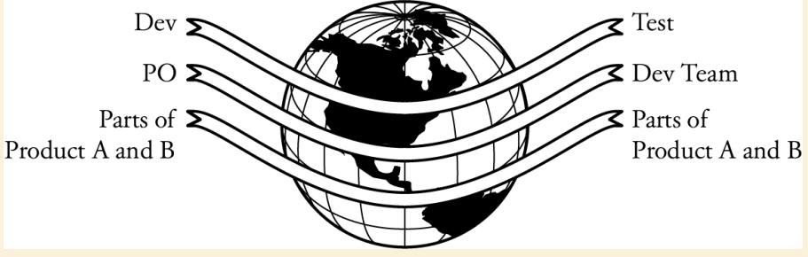

# More Effective Distributed Agile Teams
본 장에서는 지역적으로 분산된 팀들간에 효율적인 업무 방법에 대해서 설명한다.

## Key 원칙 : 피드백 루프 강화 (Tighten Feedback Loops)
피드백 루프 강화란?

* Product Owner : 요구사항 관련 피드백 루프 강화
* Cross-functional team : 의사 결정에 필요한 피드백 루프 강화
* Small batches : 요구사항 정의에서 데모가능한 SW까지의 피드백 루프 강화
* Test-first development : 코드와 테스트간 피드백 루프 강화

지역적으로 분산된 팀들은 피드백 루프가 느슨해진다. 
*  face to face가 안되어 잘못된 의사소통 가능성이 있다.
* 시차로 인해 응답이 지연되어 offshare로 보내기까지 더 큰 bache가 된다.
* 의사결정이 느려지고, 오류 발생률이 증가하고, 재작업이 증가하고, 처리량이 감소하고, 프로젝트가 지연된다.

언어, 국민 문화, 사이트 문화, 시차 등의 차이가 쌓여 피드백 루프는 느슨해지고, 실수가 증가한다. 분리된 조직의 개발 생산성 저하는 개인의 문제가 아니라, 이러한 차이에 의한 것이다.

